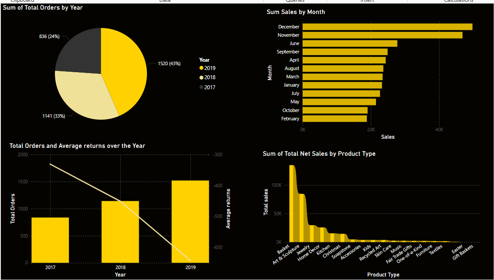

# Power BI Interactive Sales Dashboard

##  Project Overview
This Power BI dashboard visualizes key sales metrics, trends, and performance insights using two datasets: **Retail Sales Data** and **Business Retail Sales Data2**. 

##  Key Features
✅ **Sales Performance Analysis** – Track total orders, gross sales, net sales, and returns across different years.
✅ **Product Type Analysis** – Understand sales distribution by product category.
✅ **Monthly & Yearly Trends** – Identify high-performing months and yearly growth patterns.
✅ **Interactive Filters** – Use slicers to filter data by year, product type, and month.
✅ **Custom Tooltip Page** – Hover over visuals to view additional insights, such as discounts, returns, and shipping costs.

## 📁 Datasets Used
1. **Retail Sales Dataset**  
   - Month, Year, Total Orders, Gross Sales, Discounts, Returns, Net Sales, Shipping, Total Sales
2. **Business Retail Sales Dataset**  
   - Product Type, Net Quantity, Gross Sales, Discounts, Returns, Total Net Sales
  

## Dashboard Visuals
- **Total Orders by Year (Pie Chart)**
- **Sales by Month (Bar Chart)**
- **Total Orders & Average Returns Over the Year (Column & Line Chart)**
- **Total Net Sales by Product Type (Bar Chart)**

## Technologies Used
- **Power BI** for visualization
- **Data Cleaning & Transformation** in Power Query

 **Contributions & Feedback**
Have suggestions for improvement? Feel free to share your thoughts! 

